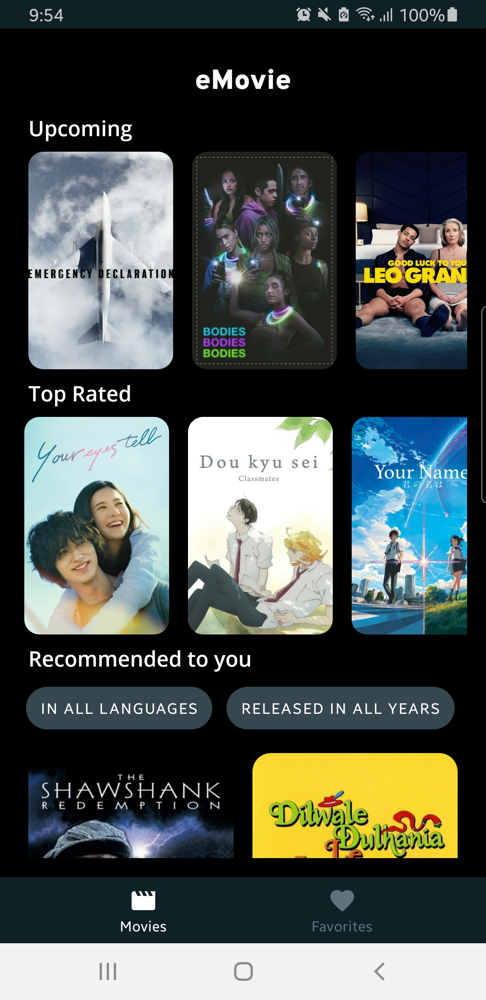
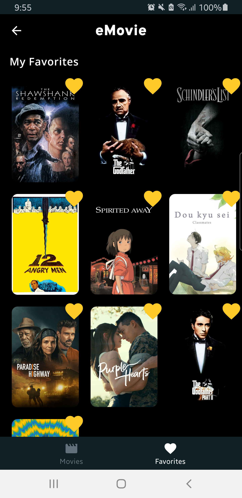
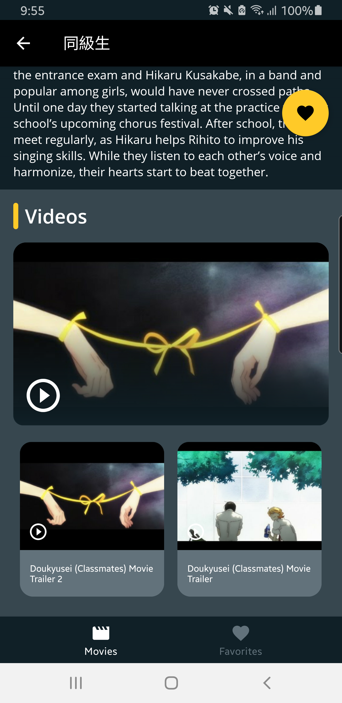

## eMovie Application Challenge

**eMovie** is an Android application that provides information of movies. The goal of this app is to show 
some movies from TheMovie DB servers showing the "Upcoming" and "Top Rated" movies. When pressing any movie 
you can watch the details of it.

## Developed with

* UI
   * [Compose](https://developer.android.com/jetpack/compose) declarative UI framework
   * [Material design](https://material.io/design)

* Tech/Tools
    * [Kotlin](https://kotlinlang.org/) 100% coverage
    * [Coroutines](https://kotlinlang.org/docs/reference/coroutines-overview.html) and [Flow](https://developer.android.com/kotlin/flow) for async operations
    * [Hilt](https://developer.android.com/training/dependency-injection/hilt-android) for dependency injection
    * [Jetpack](https://developer.android.com/jetpack)
        * [Compose](https://developer.android.com/jetpack/compose)
        * [Navigation](https://developer.android.com/topic/libraries/architecture/navigation/) for navigation between fragments
        * [ViewModel](https://developer.android.com/topic/libraries/architecture/viewmodel) that stores, exposes and manages UI state
    * [Retrofit](https://square.github.io/retrofit/) for networking
    * [Landscapist Glide](https://github.com/skydoves/landscapist) for image loading

* Modern Architecture
    * Single activity architecture (with [Navigation component](https://developer.android.com/guide/navigation/navigation-getting-started)) that defines navigation graphs
    * MVVM for presentation layer
    * [Android Architecture components](https://developer.android.com/topic/libraries/architecture) ([ViewModel](https://developer.android.com/topic/libraries/architecture/viewmodel), [Navigation](https://developer.android.com/jetpack/androidx/releases/navigation))
    * [Android KTX](https://developer.android.com/kotlin/ktx) - Jetpack Kotlin extensions

# Architecture

* This project was developed using CLEAN Architecture and MVVM (Model View ViewModel) 
* It uses Single Source of Truth principle so that all data from API is stored in Room DB. 
  This way we see our database as the SSOT and we listen for changes related with this data 
  source of the app
* The architecture contains the following features:
    * data:
        * remote: Using Retrofit (REST API) and OkHttp (Security and interceptors)
            * Contains all the logic for getting movie data from API including mappers, models and others
            * Repository implementation that links with domain layer
        * local: Using Room DB
            * Contains all the logic for creating the RoomDB Instance, Entities and Daos.
            * Repository implementation that links with domain layer

    * domain: Intermediate layer between data and presentation. We manage the business logic in this layer 
      using the proper abstraction to establish link between ui and data layer

    * ui: This contains the models and the different fragments related to home, detail and favorite screens

    * di: Contains logic of Dependency Injection using Dagger Hilt, separating the scopes for any
      layer and the ViewModel.

# Screenshots

# Extra functionalities

* Swipe Refresh Layout in the list
* ic_launcher for eMovie logo
* Favorite movies
* Filter recommended movies with language and release year options
* Expandable/Collapsable Toolbar in detail screen
* Splash Screen API from Jetpack
